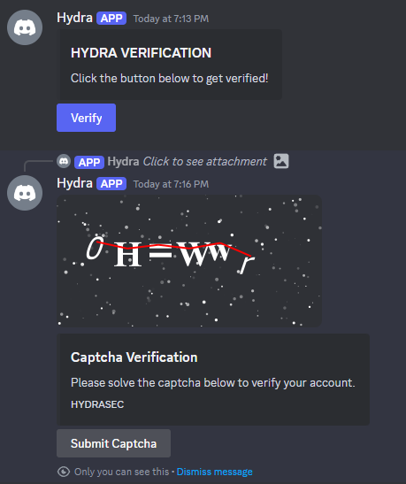
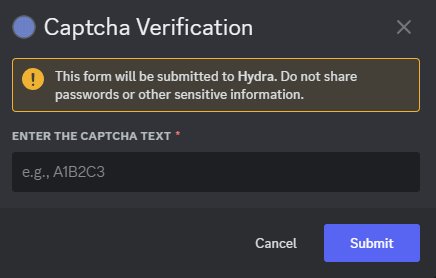

# Hydra Security

Hydra security is a customizable Discord bot inspired by Wick-bot that provides a offline captcha verification system using canvas.




## **💎 Features**
- ✅ **Verification System**: Users must pass a CAPTCHA challenge before accessing the server.
- ✅ **Captcha Customization**: Admins can set the **timeout, length, and footer** of the CAPTCHA.
- ✅ **Slash Command Control**: Admins can configure **verification settings** directly via `/setchannel`, `/setrole`, etc.
- ✅ **Auto-Resend Verification Message**: Use `/override` to remove and recreate the verification message in a specified channel.
- ✅ **Configurable via `config.toml`**: All settings are stored in a TOML file for easy management.

---

## **📦 Installation**

This presumes you have Node.js installed, if you do not install it here -> [NODE](https://nodejs.org/en)

### **1️⃣ Clone the Repository**
```sh
git clone https://github.com/YOUR_USERNAME/HYDRA-SECURITY.git
cd HYDRA-SECURITY
```

### **2️⃣ Install Dependencies**
```sh
npm install
```

### **3️⃣ Run the Setup Script**
This will create a **`config.toml`** file where you can input your bot's credentials.
```sh
setup.bat
```

---

## **⚙️ Configuration (`config.toml`)**
This file stores all **bot settings**.

```toml
[bot]
token = "YOUR_BOT_TOKEN"
user_id = "YOUR_BOT_USER_ID"
app_id = "YOUR_BOT_APP_ID"

[channels]
verification = "YOUR_VERIFICATION_CHANNEL_ID"

[server]
guild_id = "YOUR_SERVER_ID"
verification_role_id = "YOUR_VERIFICATION_ROLE_ID"

[captcha]
timeout = 300  # Timeout for CAPTCHA (seconds)
length = 5  # Number of characters in CAPTCHA
footer = "HYDRASEC"

[permissions]
whitelisted_roles = [ "ID1", "ID2" ] # 1ID or multiple ID(s)
```

---

## 💻 Running HYDRA
Start the bot using:
```sh
hydra.bat
```

Alternatively, run
```sh
node .\src\master.js
```
This will spawn a console, once closed the bot will terminate.

---

## **⌨️ Slash Commands**
HYDRA-SECURITY uses **slash commands** for configuration.

| Command               | Description |
|----------------------|-------------|
| **`/setchannel`** `<channel_id>` | Set the verification channel |
| **`/setrole`** `<role_id>` | Set the verification role |
| **`/settimeout`** `<seconds>` | Set CAPTCHA timeout duration |
| **`/setlength`** `<length>` | Set CAPTCHA length |
| **`/setfooter`** `<text>` | Customize CAPTCHA embed footer |
| **`/override`** `[channel_id]` | Resend verification message (optional channel override) |

---

## **📜 License**
**HYDRA-SECURITY** is open-source and distributed under the **MIT License**.
